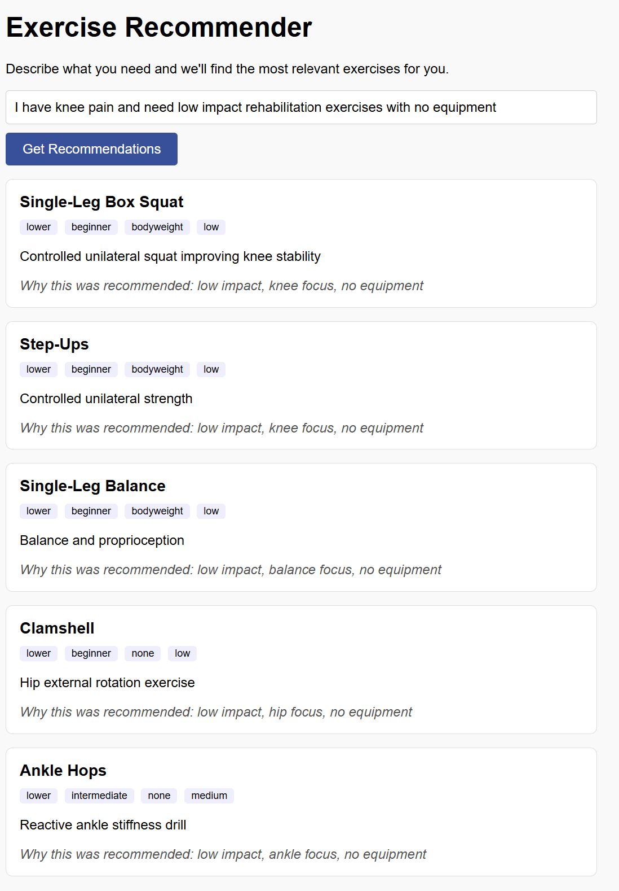

# Apollo LLM Internship Assessment — Exercise Recommender

Exercise recommender system with semantic retrieval and LLM re-ranking.

Users describe what they need in plain text and the system returns the most relevant exercises from a database of 60 entries, using vector similarity search for retrieval and an LLM for intelligent re-ranking.

---

## Table of Contents
- [Tech Stack](#tech-stack)
- [How It Works](#how-it-works)
- [Project Structure](#project-structure)
- [Local Setup](#local-setup)
- [API](#api)
- [Scalability](#scalability)
- [Personalization via Onboarding](#personalization-via-onboarding)
- [Time Spent](#time-spent)

---

## Tech Stack

- **Backend**: FastAPI
- **Database**: PostgreSQL + pgvector
- **Embeddings**: sentence-transformers (all-MiniLM-L6-v2, runs locally on CPU)
- **LLM Re-ranking**: Groq API (llama-3.1-8b-instant)
- **Frontend**: Plain HTML + JavaScript

---

## Demo



---

## How It Works

### Pipeline

```
User Query → Embed Query → Vector Similarity Search → LLM Re-ranking → Top 5 Results
```

### Step 1: Retrieval
The user's query is embedded using the same sentence-transformers model used to embed the exercise database at seed time. From there, pgvector performs a cosine similarity search and returns the top 15 candidate exercises. No LLM is involved at this stage, so it stays fast and cheap.

### Step 2: Re-ranking
Those 15 candidates are then passed to the LLM along with the original query. The LLM reads each exercise's title, description, body part, difficulty, equipment, and injury focus, and returns the top 5 most relevant exercises with a brief explanation for each recommendation.

Together, these two steps keep retrieval fast while letting the LLM handle the nuanced judgment of what actually fits the user's need.

### Schema Modification
The original dataset fields (`id`, `title`, `description`, `tags`, `body_part`, `difficulty`) were kept as-is. One column was added:

- **`embedding vector(384)`**: stores the 384-dimensional vector representation of each exercise generated by the sentence-transformers model. This column is what enables semantic similarity search via pgvector. Without it, retrieval would be limited to exact keyword matching which would miss semantically relevant exercises that use different wording than the query.

---

## Project Structure

```
apollo-llm-assessment/
  backend/
    config.py       # shared constants (embedding model name)
    database.py     # database connection and vector search query
    main.py         # FastAPI app and API endpoints
    reranker.py     # LLM re-ranking logic
    retrieval.py    # query embedding and candidate retrieval
    seed.py         # one-time script to load CSV and generate embeddings
  db/
    init_db.sh      # creates and initializes the database
    schema.sql      # table definitions
    seed_index.sql  # vector index (built after seeding)
  frontend/
    index.html      # minimal HTML interface
  exercises.csv     # exercise dataset (60 rows)
  requirements.txt
  run.py            # starts the server from the project root
```

---

## Local Setup

### Prerequisites
- Python 3.10+
- PostgreSQL 18
- pgvector extension (see note below)
- Git Bash (Windows) or any Unix shell
- A free Groq API key from console.groq.com

### pgvector on PostgreSQL 18 (Windows)
pgvector does not have a pre-built installer for PostgreSQL 18 on Windows. You must compile it from source using Visual Studio Build Tools:

```bash
git clone https://github.com/pgvector/pgvector.git
cd pgvector
set "PGROOT=C:\Program Files\PostgreSQL\18"
nmake /F Makefile.win
nmake /F Makefile.win install
```

Run these commands in a Developer Command Prompt for Visual Studio opened as Administrator.

### Installation

1. **Clone the repo**
```bash
git clone https://github.com/sins42/apollo-llm-assessment.git
cd apollo-llm-assessment
```

2. **Install dependencies**
```bash
pip install -r requirements.txt
```

3. **Set up environment variables**
```bash
cp .env.example .env
```
Fill in your `DATABASE_URL` and `GROQ_API_KEY` in `.env`.

4. **Initialize the database**
```bash
bash db/init_db.sh
```
This drops and recreates the database on each run. This is intentional for development to ensure a clean state. In production, schema migrations would be used instead.

5. **Seed the database**
```bash
python backend/seed.py
```
Downloads the embedding model (~90MB, one-time), generates embeddings for all 60 exercises, inserts them into the database, and builds the vector index.

6. **Start the server**
```bash
python run.py
```

7. **Open the frontend**
```
http://localhost:8000/static/index.html
```

---

## API

### `POST /recommend`
Takes a plain text query and returns the top 5 recommended exercises.

**Request:**
```json
{ "query": "knee pain, low impact exercises" }
```

**Response:**
```json
{
  "results": [
    {
      "id": "EX_001",
      "title": "Single-Leg Box Squat",
      "description": "Controlled unilateral squat improving knee stability",
      "body_part": "lower",
      "difficulty": "beginner",
      "equipment": "bodyweight",
      "injury_focus": "knee rehab",
      "intensity": "low",
      "reason": "Low-impact and specifically targets knee stability which directly addresses the user's knee pain concern."
    }
  ]
}
```

Interactive API docs available at `http://localhost:8000/docs`.

---

## Scalability

### Dataset grows to 100k+ exercises
Right now the database has 60 exercises, so searching through all of them is instant. But as the dataset grows, comparing a query vector against every single row one by one would get increasingly slow.

The IVFFlat index already in place solves this by grouping similar vectors into clusters when the index is built. When a query comes in, instead of scanning all 100k exercises it only checks the most relevant clusters. This makes search significantly faster without meaningfully hurting accuracy.

At even larger scale, such as millions of exercises, switching to an HNSW index would be the next step. HNSW trades a small amount of accuracy for much faster query times and handles very large datasets better than IVFFlat.

Another layer on top of that would be adding SQL pre-filters before the vector search runs. For example, if a user searches "upper body exercises", the query can first filter by `body_part = 'upper'` in SQL, cutting the candidate pool down before pgvector does any similarity math. Less data to search means faster results.

### Multiple concurrent users
Three things would need attention as concurrent traffic increases:

**Async request handling:** FastAPI is built on async Python so it can handle multiple incoming requests at the same time without blocking. This is already handled out of the box.

**Database connection pooling:** Right now the code opens a fresh database connection for every single request and closes it when done. Under heavy traffic, opening and closing connections that frequently would overwhelm PostgreSQL. A connection pool, using a library like `asyncpg`, keeps a set of connections open and reuses them across requests. This is much more efficient and prevents the database from becoming a bottleneck.

**LLM call rate limiting:** The Groq API has limits on how many requests can be sent per minute. If 50 users query at the same time, 50 LLM calls would fire simultaneously and the API would start rejecting them. A queue would line up incoming LLM calls and control how many go out at once, keeping the system stable under load instead of failing unpredictably.

---

## Personalization via Onboarding

### What data to collect
The goal of onboarding is to build enough of a user profile that the system can make smart decisions before the user even types a query. The most useful data to collect would be:

- **Goals**: strength, endurance, rehab, performance
- **Sport or activity type**: a soccer winger needs completely different exercises than a powerlifter or a weekend runner. Knowing the sport lets the system prioritize movement patterns that actually transfer to what the user does
- **Injury history**: current or past injuries and the affected body parts
- **Equipment available**: gym, home, bodyweight only
- **Intensity preference**: low, medium, high
- **Difficulty level**: beginner, intermediate, advanced
- **Session availability**: how many days per week and how long per session. There is no point recommending a 5-exercise circuit to someone who only has 20 minutes
- **Recovery status**: are they in-season, off-season, or post-surgery? An athlete in-season needs maintenance work, not heavy loading

### How it influences retrieval and ranking

**Retrieval:** The onboarding data would be used as hard filters in the SQL query before the vector search runs. For example, a user with no equipment would never see exercises that require a barbell, no matter how relevant they seem to the query. Beyond filtering, the system could also boost certain fields during retrieval based on the user's goal. Someone in rehab should have `injury_focus` weighted more heavily in the similarity search than someone training for performance.

On top of that, the system could dynamically rewrite the query before embedding it. If a user types "knee exercises" but their profile says they are post-surgery, the system rewrites it to "low-impact knee rehab exercises" before searching. The user gets better results without needing to know how to phrase things perfectly.

**Re-ranking:** The user profile would then be injected into the LLM prompt so re-ranking happens with full context:
> "This user is recovering from a knee injury, has only bodyweight equipment, and prefers low intensity workouts."

This way the recommendations feel personal without needing to change the underlying retrieval architecture at all.

To make this concrete: two users both search "upper body strength". User A is a 19-year-old soccer player in pre-season. User B is a 45-year-old with a history of shoulder injuries. The query is identical but the right answer is completely different. Onboarding data is what lets the system tell them apart.

### Inspiration from Spotify / Netflix

Spotify does not ask you what song you want every time you open the app. It learns from what you skip, replay, and save, and uses those signals to build a taste profile over time. The same idea applies here. Tracking which recommendations a user completes or skips would let the system gradually weight the re-ranking prompt toward exercises they actually engage with, rather than relying only on what they said during onboarding.

This matters because behavior is more honest than self-reporting. If a user says they want high intensity workouts but consistently ignores those recommendations, that signal should carry more weight than their original answer. Netflix calls this the difference between stated preferences and revealed preferences, and it is one of the reasons their recommendations feel so accurate over time.

Netflix's two-stage ranking also mirrors this retrieval + re-ranking architecture directly. At scale, the re-ranking model could be fine-tuned on real user interaction data rather than relying on a general-purpose LLM, making it progressively smarter the more people use it.

---

## Time Spent

| Task | Time |
|------|------|
| Data setup and database schema | 45 min |
| Seed script and embeddings | 30 min |
| Retrieval layer | 20 min |
| Re-ranking layer | 30 min |
| FastAPI backend | 20 min |
| Frontend | 20 min |
| Debugging and testing | 45 min |
| README and documentation | 30 min |
| **Total** | **~4 hrs** |
